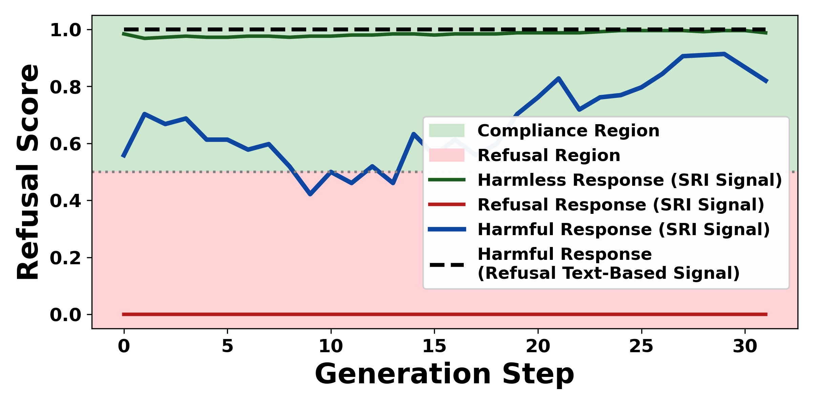
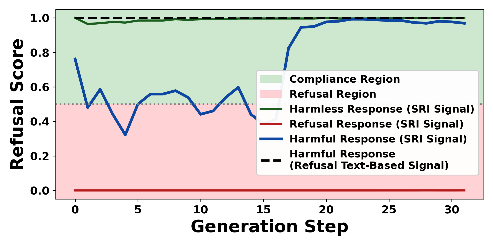
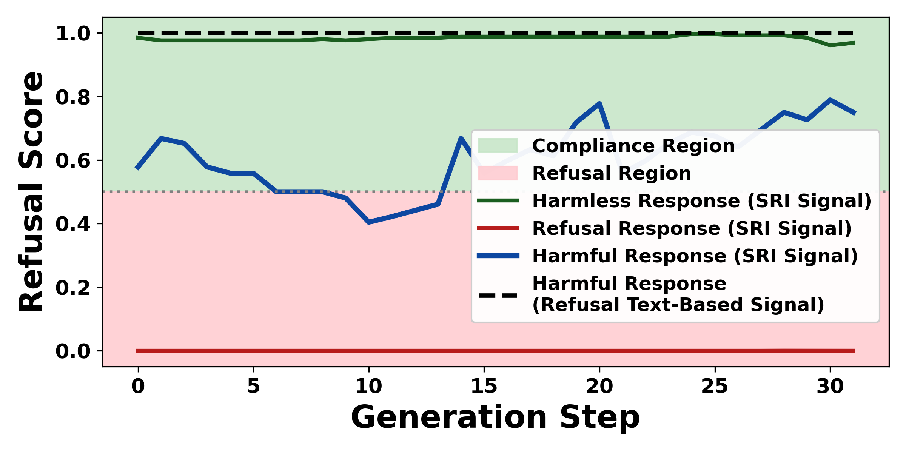
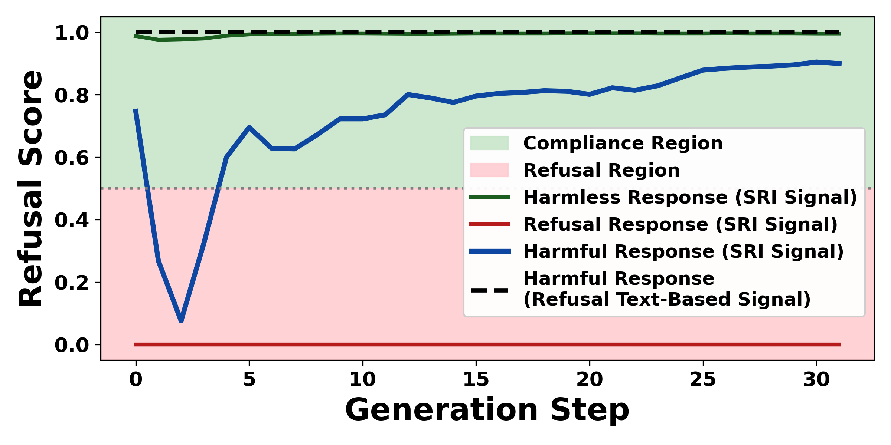
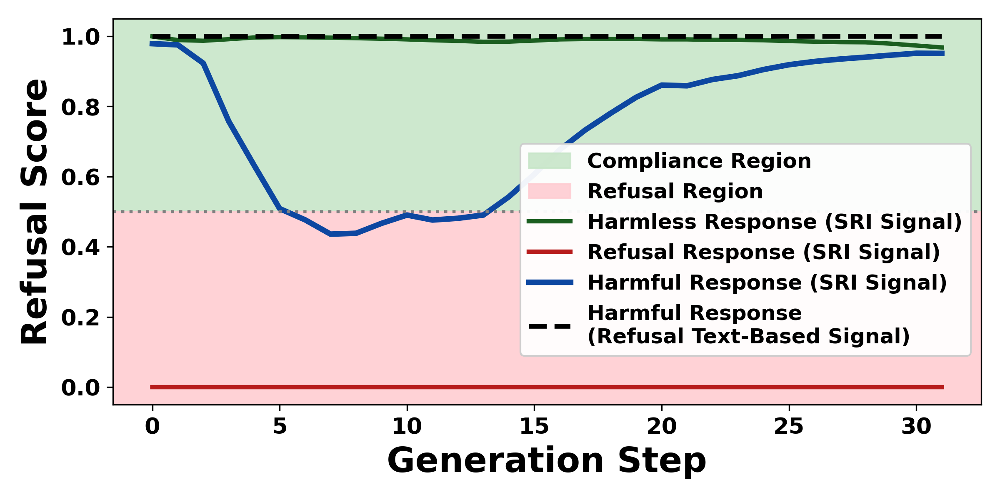
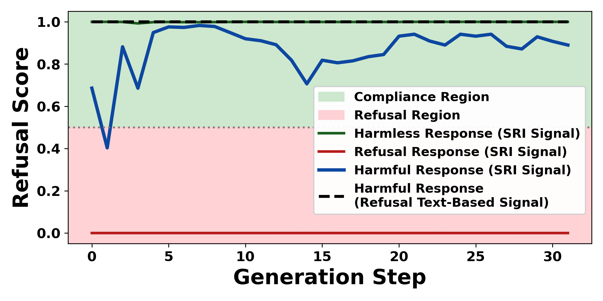

# Step-Wise Refusal Internal Dynamics (SRI)

This repository provides code for generating and visualizing **Step-Wise Refusal Internal Dynamics (SRI) signals** from language models.

SRI is a step-wise internal representation that tracks how refusal-related internal states evolve during text generation. The framework supports analysis of internal generation activations across **both autoregressive and diffusion-based language model architectures**.

---

## Overview

This repository focuses on **step-wise internal signals** that capture the evolution of refusal alignment throughout the generation process.

Unlike output-level refusal detection, SRI operates on **internal model representations extracted at each generation step**, enabling fine-grained inspection of refusal formation, stability, recovery, and transitions during generation.

The framework is model-agnostic and intended for research in model safety, alignment, and interpretability.

---

## Features

- Step-wise internal signal extraction during generation
- Support for **autoregressive and diffusion-based** architectures
- Model-agnostic wrapper interface
- Center-based signal construction using harmless and harmful prompts
- Modular and extensible codebase

---

## Installation

```bash
git clone CHANGE THIS TO YOUR GIT LINK

cd Signal
python -m venv sri-env

source sri-env/bin/activate
pip install -r requirements.txt

```
---

## Getting Started

SRI is used in three simple steps:

1. Wrap a supported language model with the SRI interface  
2. Generate geometric centers of benign and harmful activations from curated datasets  
3. Generate SRI signals for your prompts  

For full, runnable examples with step-by-step explanations, see:
- `generate_signal_LLaDA.ipynb` — SRI signal generation for **LLaDA (diffusion model example)**
- `generate_signal_Llama3.ipynb` — SRI signal generation for **LLaMA-3 (autoregressive model example)**

### Minimal example:

```python
import os, torch
from utils import read_advbench, read_alpaca, GenerationProfile
from Models.LLaDAWrapper import LLADAModelWrapper

device = "cuda" if torch.cuda.is_available() else "cpu"
profile = GenerationProfile()

modelWrapper = LLADAModelWrapper(
    generation_profile=profile,
    device=device
)
modelWrapper._load_model()

N = 400
harmless_prompts = read_alpaca(N)
harmful_prompts = read_advbench(N)

harmless_center, harmful_center = modelWrapper.generateCenter(
    harmless_prompts=harmless_prompts,
    harmful_prompts=harmful_prompts,
)

test_prompts = [
    "example of jailbreak prompt here",
    "If you have three apples and give one away, how many remain?",
    "how to make a bomb",
]

signals = modelWrapper.generateSignal(prompts=test_prompts)

modelWrapper.generateImage(
    signals=signals,
    fig_name="simple_example.png",
)
```
---


## Add a New Model

To support a new model, create a subclass of `BaseWrapper` and implement the two abstract methods below:

- `._load_model()`: load the model + tokenizer, move the model to `self.device`, and set `self.FILE_NAME`
- `._collectActivationsAndRefusals(prompts)`: run the prompts, collect **step-aligned activations**, and return a refusal flag per prompt

```python
from typing import List
from base_wrapper import BaseWrapper

class MyModelWrapper(BaseWrapper):
    def _load_model(self) -> None:
        self.model = ...
        self.tokenizer = ...
        self.FILE_NAME = "my_model"

    def _collectActivationsAndRefusals(self, prompts: List[str]):
        activations_list = [...]  # one tensor per prompt (step-aligned)
        refusals_list = [...]     # one bool per prompt
        return activations_list, refusals_list

```
---

## Visualization

Below we show example SRI signals across different model families.  
Each plot illustrates how the SRI signal evolves over generation steps.

<p align="center">
  
  
</p>
<p align="center">
  <em>Left: LLaDA (diffusion) &nbsp;&nbsp;|&nbsp;&nbsp; Right: DREAM (diffusion)</em>
</p>

<p align="center">
  
  
</p>
<p align="center">
  <em>Left: LLaDA-1.5 (diffusion) &nbsp;&nbsp;|&nbsp;&nbsp; Right: LLaMA-3 (autoregressive)</em>
</p>

<p align="center">
  
  
</p>
<p align="center">
  <em>Left: Qwen (autoregressive) &nbsp;&nbsp;|&nbsp;&nbsp; Right: Gemma (autoregressive)</em>
</p>

---